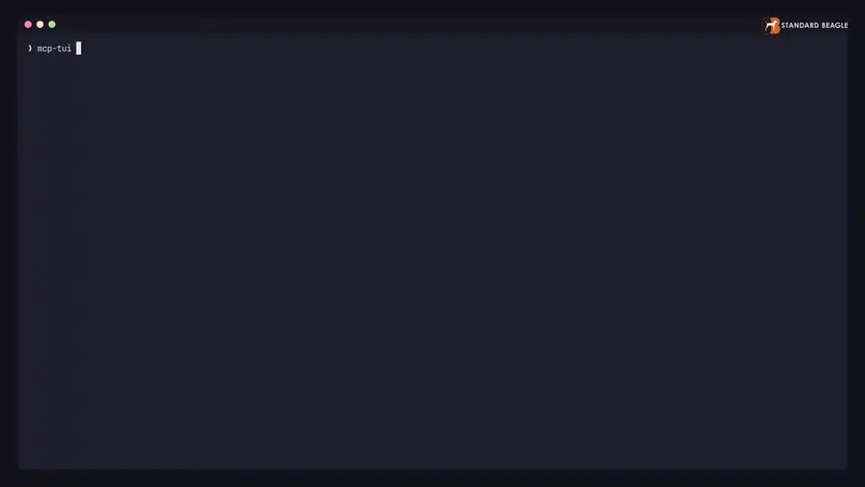
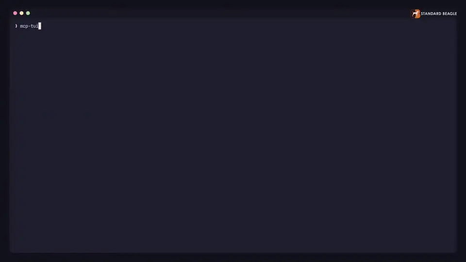
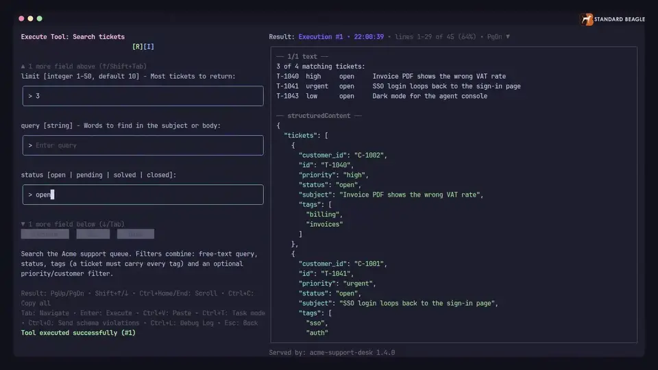
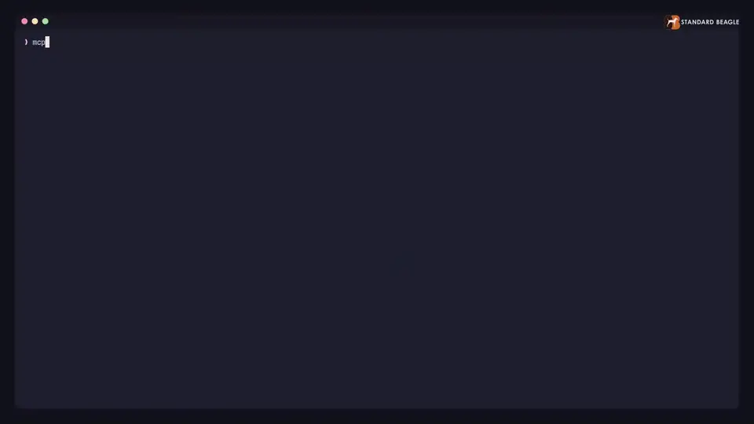

# MCP-TUI

[](https://github.com/standardbeagle/mcp-tui)
[](https://www.npmjs.com/package/@standardbeagle/mcp-tui)
[](LICENSE)
[](https://dev.standardbeagle.com/mcp-tui/)

**Test, debug and automate Model Context Protocol servers from your terminal.**

Point mcp-tui at an MCP server, run any tool from a form built from its input
schema, and get the same call as a CLI command for your CI. When a connection
fails, it tells you why: the HTTP status, the stray line on stdout, the
handshake step the server skipped, and the flag that fixes it.

<p align="center">
  
</p>

## Install

```bash
go install github.com/standardbeagle/mcp-tui@latest
# or
npm install -g @standardbeagle/mcp-tui
```

## Use

```bash
mcp-tui --url http://localhost:8080/mcp                          # TUI
mcp-tui --cmd node --args server.js                              # a stdio server
mcp-tui --url http://localhost:8080/mcp tool list                # CLI
mcp-tui --url http://localhost:8080/mcp tool call search_tickets status=open limit=3
mcp-tui verify http://localhost:8080/mcp                         # spec and security probes
mcp-tui conform --report-junit conform.xml http://localhost:8080/mcp
```

## Why connections fail, named

A wrong path, the wrong transport, a stdio server logging to stdout, a
server that ignores `server/discover`, a missing OAuth sign-in: each is
reported with its cause and fix, not as a timeout.

<p align="center">
  
</p>

## From a manual check to CI

`c` in the TUI copies the CLI command for a call; `Ctrl+E` exports the whole
session as a replay script. The CLI prints JSON for `jq`, refuses arguments
that break the tool's schema, and exits non-zero on tool errors with
`--strict-errors`.

<p align="center">
  
</p>

## Conformance for CI

`verify` probes origin and DNS-rebinding protection, content types, tool
names and list order. `conform` runs every protocol scenario plus the probes
and writes a JUnit report.

<p align="center">
  
</p>

## What it covers

| | |
|---|---|
| Transports | stdio, streamable HTTP, SSE (deprecated) |
| Protocol | MCP 2026-07-28 (stateless, multi round-trip requests, list caching) and earlier; `--protocol-version` pins one |
| Server features | tools with annotations and output schemas, resources and templates, prompts, completion, progress, server logs, tasks, subscriptions |
| Client features | elicitation, sampling and roots, answered in the TUI or from stub flags in the CLI |
| OAuth | client credentials, authorization code with PKCE, dynamic registration, Client ID Metadata Documents, enterprise managed authorization (SEP-990), a token cache |
| Debugging | every JSON-RPC message both ways, HTTP timings, the OAuth flow step by step, credentials masked |
| Config discovery | servers configured for Claude Desktop and VS Code |

## Documentation

**<https://dev.standardbeagle.com/mcp-tui/>**: [how-to guides](https://dev.standardbeagle.com/mcp-tui/how-to/) with recorded runs, [error messages](https://dev.standardbeagle.com/mcp-tui/reference/errors/), the [CLI reference](https://dev.standardbeagle.com/mcp-tui/reference/cli/) and [videos](https://dev.standardbeagle.com/mcp-tui/videos/).

## Contributing

See [CONTRIBUTING.md](CONTRIBUTING.md) and [ARCHITECTURE.md](ARCHITECTURE.md). The demo videos are recorded from scripts in [docs/recordings](docs/recordings/README.md). Issues and PRs welcome.

## License

[MIT](LICENSE)
